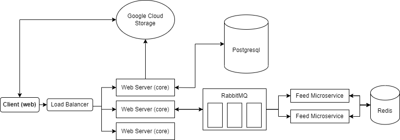

# Friendsfeed

A social network for friends to see their life updates only to support friends communication without influencers, creators, pages, etc...

## Technologies

* Node.js
* TypeScript
* Nest.js
* PostgreSQL
* TypeORM
* Kysely (query builder)
* Redis
* RabbitMQ
* Google Cloud Storage
* Firebase Cloud Messaging (Notifications)
* JWT Authentication
* Swagger

## System Architecture

## Docs

Swagger [https://friendsfeed.onrender.com/api/v1.0/docs](https://friendsfeed.onrender.com/api/v1.0/docs)
> Note: It could take up to 30 seconds to load (because of the free hosting).

## Features

The following features are available: (without details)

* Authentication:
  * Sign up
  * Login
  * Logout
  * JWT-based auth with Refresh tokens

* Users:
  * Get my profile
  * Get user profile with friendship status
  * Update profile picture
  * Update profile

* Friendships:
  * Friendship request
  * Accept friendship request
  * Reject friendship request
  * Get/Filter/Search friendship requests
  * Get/Filter/Search friends

* Posts:
  * Create post
  * Get/Filter posts of a user
  * Get post by id
  * Update post
  * Delete post

* Comments:
  * Create comment on a post
  * Get comments of a post
  * Get comment by id
  * Update comment
  * Delete comment

* Likes:
  * Like a post
  * Unlike a post
  * Get likes of a post

* Notifications:
  * Get unread notifications count
  * Get notifications and mark them as read
  * Send notification on a post like or comment
  * Send notification on a friendship request
  * Send notification on a friendship request acception

* Feed (posts of my friends):
  * Store each user's feed using a distributed worker
  * Get feed of a user (autoscroll)
 
## Design Patterns

* Utilized the Dependency Injection Pattern (built in Nest.js by default) to achieve the [Dependency Inversion Principle (D in SOLID)](https://martinfowler.com/bliki/InversionOfControl.html) for loosely coupled modules.
* Utilized the Repository Pattern to decouple the service (business logic) layer from the data access layer.

## Feed Worker

It is a distributed worker (nestjs microservice) that stores each user's feed in the PostgreSQL database using Kysely query builder. It communicates with the core monolith using RabbitMQ. It listens to posts creation events and updates the feed of the friends of the user. 
